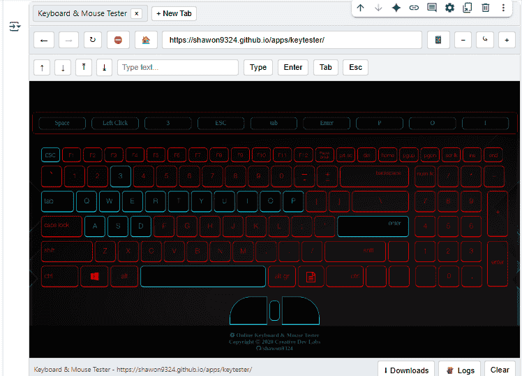

# Colab Browser with Playwright

This notebook provides an **interactive browser interface inside Google Colab**, built on top of [Playwright](https://playwright.dev/).  
It lets you navigate the web, manage tabs, interact with pages, and track downloads — all without leaving a notebook.

## Features

- Multiple tabs with history (back/forward navigation).
- Click support (left, right, middle, double click) with modifier keys.
- Scroll and smooth wheel scrolling.
- Zoom in/out and reset (CSS zoom).
- Toggle between desktop and mobile view.
- Text input and keyboard key presses (Enter, Tab, Esc, etc.).
- Stop/reload navigation and home shortcut.
- Download manager with progress, ETA, speed, and logs.
- Screenshot-based rendering inside the notebook with clickable UI.

## How It Works

- Uses **Playwright (Chromium)** in headless mode to control browser pages.
- Injects a **custom JavaScript UI** in the Colab output cell for navigation, tabs, and interactions.
- Screenshots of the active page are streamed back to the notebook, enabling click and scroll mapping.
- State (tabs, active page, zoom, history) is managed in Python, while the front-end UI syncs via Colab’s `output.register_callback`.

## Limitations

- Rendering is screenshot-based, not a live DOM view.
- Performance depends on Colab runtime resources.
- Certain interactive or GPU-heavy sites may not work as expected.
